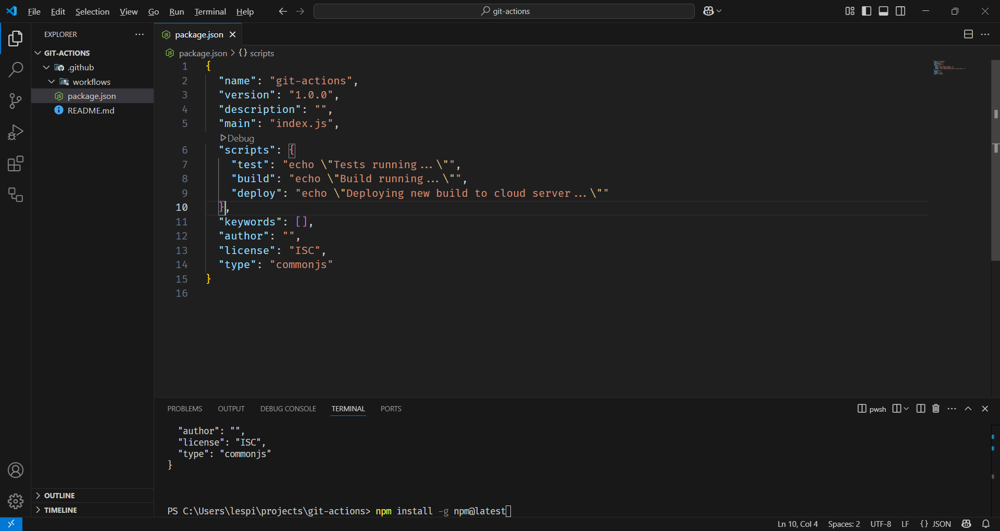
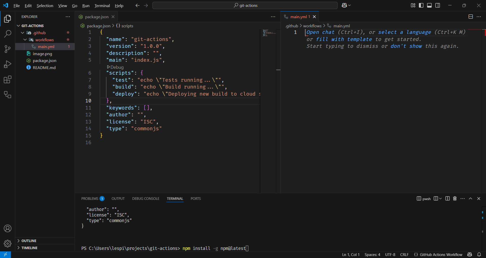
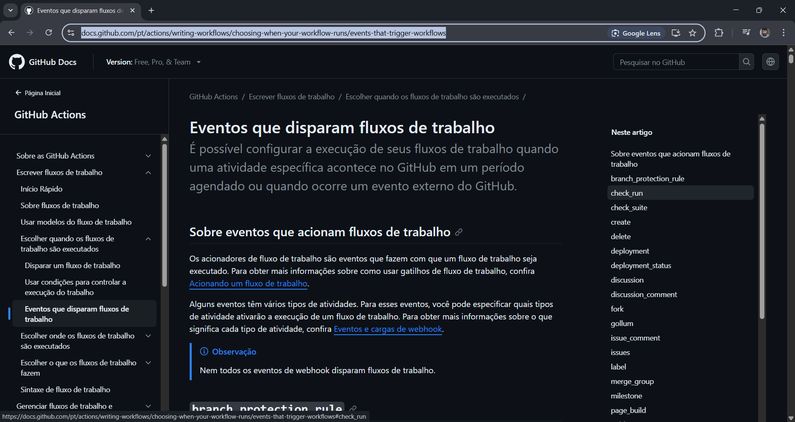
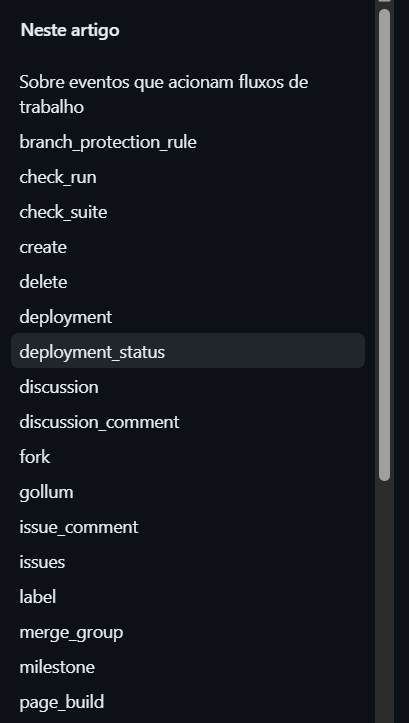
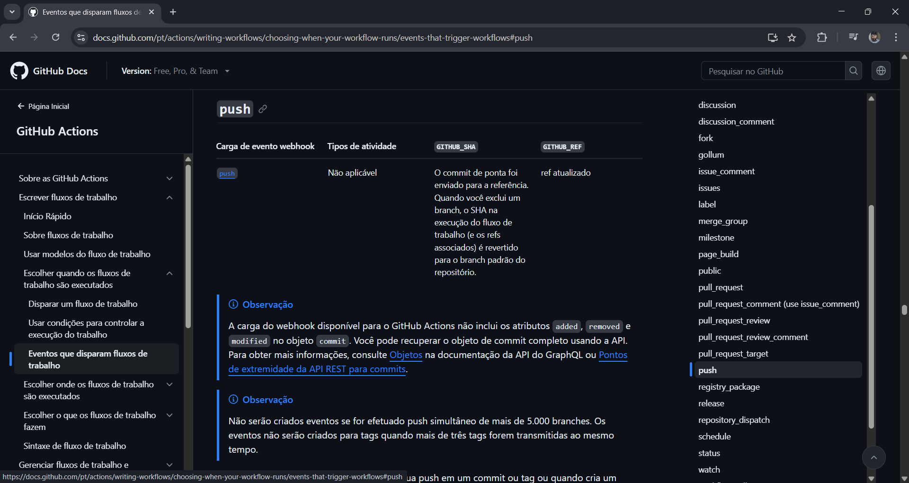
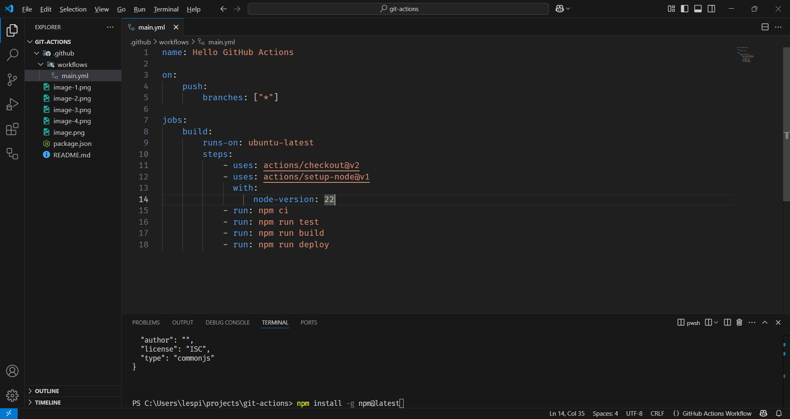

# Github Actions Workflow

GitHub Actions é uma plataforma de integração contínua e entrega contínua (CI/CD) que permite automatizar a sua compilação, testar e pipeline de implantação.

## Criando um um Workflow 

### Criar um projeto NodeJS

- Atualizar o NPM caso seja preciso:

```js
npm install -g npm@latest
```
- Criar o package JSON:

```js
> npm init -y
Wrote to C:\Users\lespi\projects\git-actions\package.json:

{
  "name": "git-actions",
  "version": "1.0.0",
  "description": "",
  "main": "index.js",
  "scripts": {
    "test": "echo \"Error: no test specified\" && exit 1"
  },
  "keywords": [],
  "author": "",
  "license": "ISC",
  "type": "commonjs"
}
```

- Criar pasta

.github/workflows



- Inserir os scripts desejados

```js
"scripts": {
    "test": "echo \"Tests running...\"",
    "build": "echo \"Build running...\"",
    "deploy": "echo \"Deploying new build to cloud server...\""
  }
```



- Eventos disponíveis:





- Sobre o Push



- Criar o arquivo YML:

```yml
name: Hello GitHub Actions

on:
    push:
        branches: ["*"]

jobs:
    build:
        runs-on: ubuntu-latest
        steps:
            - uses: actions/checkout@v2
            - uses: actions/setup-node@v1
              with:
                  node-version: 16
            - run: npm ci
            - run: npm run test
            - run: npm run build
            - run: npm run deploy
```




## Bibliografia

> https://www.youtube.com/watch?v=W_Fhjmsq7hU

> https://docs.github.com/pt/actions/writing-workflows/choosing-when-your-workflow-runs/events-that-trigger-workflows

https://www.youtube.com/watch?v=F51HlrEeedw


